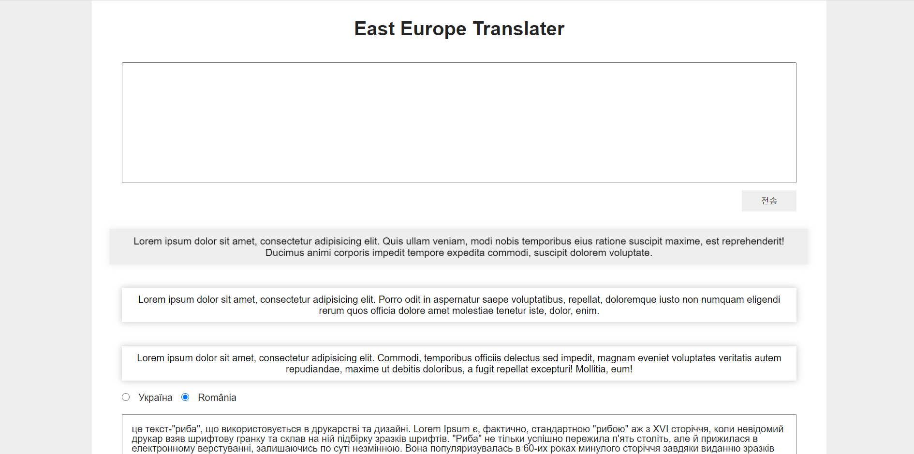
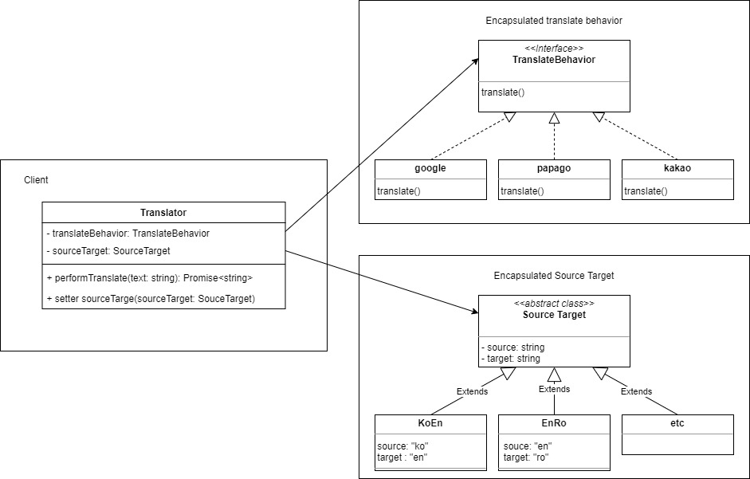
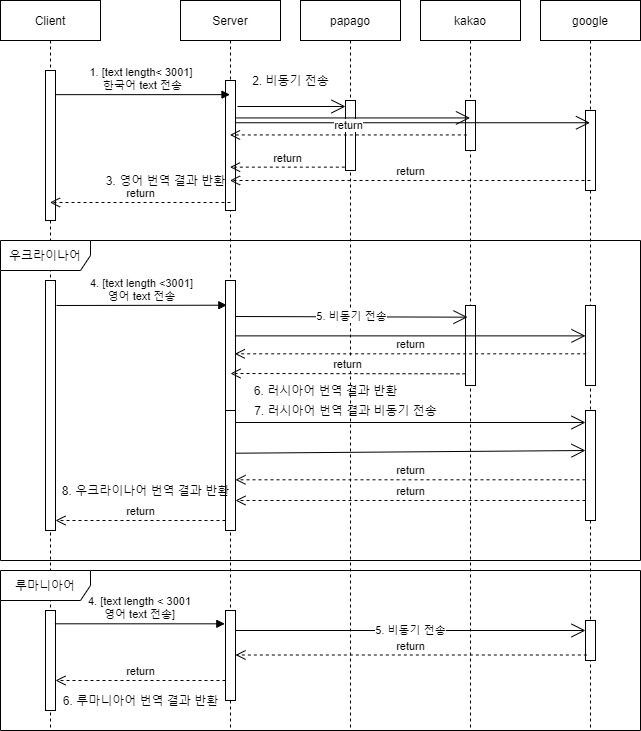
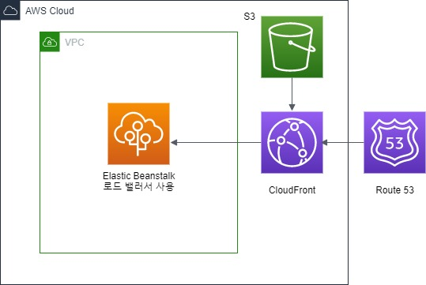
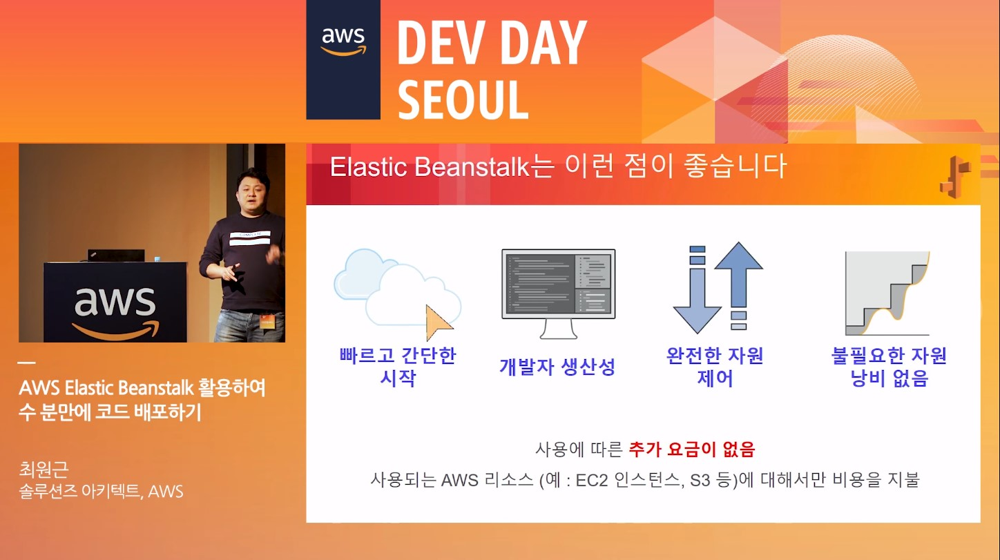

# 동유럽 언어 번역 앱 개발 프로젝트

팀원: 상진수(백엔드), 오수빈(프론트엔드)

[저작권 안내](https://github.com/sangjinsu/east-europe-translator/issues/78)

## 0. east europe translator site

[go to east europe translator](https://www.e2translate.com/)

- https://www.e2translate.com/
- https://e2translate.com/

## 1. 프로젝트 소개

### 프로젝트 주제

동유럽 언어 학습 향상을 위한 번역 웹 애플리케이션

### 프로젝트 선정 이유

- 우크라이나어 학습 효율성 향상
- 루마니아어 학습 효율성 향상

### 예상 사용 인원

- 최대 40명
- 최소 5명 이내

### 프로젝트 언어 및 환경

- 프론트엔드

  - html, javascript, css

- 백엔드
  - typescript, nest.js

### 주요 기능

- 한국어 - 영어 번역
- 영어 - 우크라이나어 번역
- 영어 - 루마니아어 번역

### 제한 사항

- Google Cloud Translation API 매월 500,000 자 초과시 요금 발생
- Naver Papago API 하루 10,000 자 초과 사용 불가
- KaKao Translation API 하루 50,000 자 초과 사용 불가

## 2. 프론트엔드 데모

## 3. 클래스 다이어그램

### 전략 패턴 사용 이유

1. 번역 활동이 조금씩 다를 뿐 개념적으로 관련된 클래스들이 존재한다.

2. 파파고, 구글, 카카오 번역 api가 있지만 다른 번역 api를 사용할 가능성이 있다.

3. 번역 요청 활동이 복잡하므로 TranslationBehavior 클래스에만 작성한다.

4. 문제점으로는 우크라이나어, 루마니아어 뿐만 아니라 폴란드어, 세르비아어 등 다양한 언어를 번역 할 때 srcTarget 클래스가 증가한다.

## 4. 시퀀스 다이어그램

## 5. AWS 다이어그램

### Elastic Beanstalk 사용 이유

1. 코드를 업로드하기만 하면 Elastic Beanstalk이 용량 프로비저닝, 로드 밸런싱, Auto Scaling부터 시작하여 애플리케이션 상태 모니터링에 이르기까지 배포를 자동으로 처리합니다.
2. Elastic Beanstalk는 추가 비용 없이 애플리케이션을 저장 및 실행하는 데 필요한 AWS 리소스에 대해서만 요금을 지불하면 됩니다.

[사진출처: AWS Elastic Beanstalk 활용하여 수 분만에 코드 배포하기 - 유튜브](https://youtu.be/AfRnvsRxZ_0)

## 6. 주차별 활동사항

| 주차  |                                                 프론트엔드                                                 |
| :---: | :--------------------------------------------------------------------------------------------------------: |
| 1주차 |                             html/css 기본 화면 구성, 한-영 fetch api 통신 연결                             |
| 2주차 |                          fetch api 응답 button 객체 생성, 한국어 입력 글자수 제한                          |
| 3주차 | 2차 번역 요청과 응답 확인, 개행문자 줄바꿈으로 변경, async/await 구문으로 코드 정리, button 생성 오류 수정 |

| 주차  |                                              백엔드                                               |
| :---: | :-----------------------------------------------------------------------------------------------: |
| 1주차 |               백엔드 설계, 한-영 번역 api 생성(google, papago, kakao 번역 api 활용)               |
| 2주차 |                              영-우크라이나/영-루마니아 번역 api 생성                              |
| 3주차 | unit/e2e 테스트 작성, 글자 수 제한, 클래스 다이어그램, 시퀀스 다이어그램 작성, exception log 처리 |
