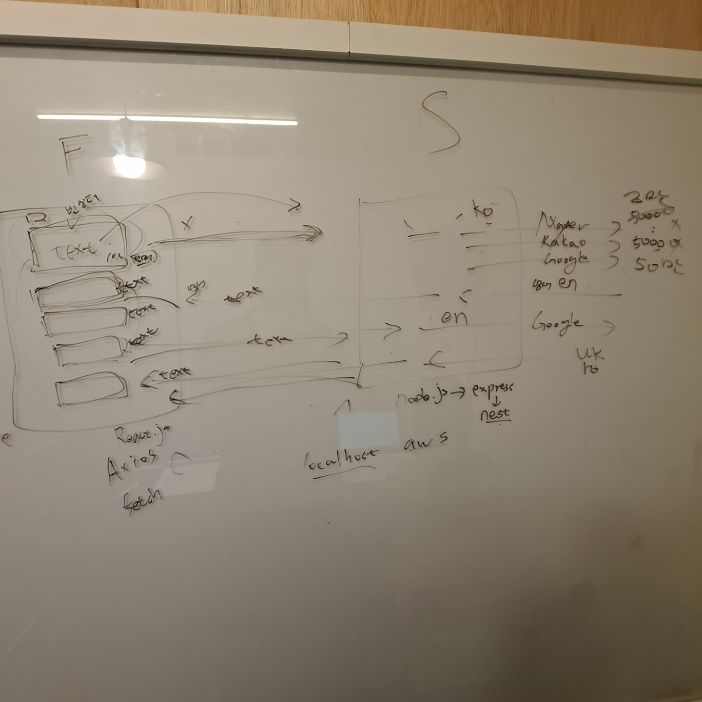

# 동유럽 언어 번역 앱 개발 프로젝트

팀원: 상진수(백엔드), 오수빈(프론트엔드)

## 1. 프로젝트 소개

### 프로젝트 주제

동유럽 언어 학습 향상을 위한 번역 웹 애플리케이션

### 프로젝트 선정 이유

- 우크라이나어 학습 효율성 향상
- 루마니아어 학습 효율성 향상

### 프로젝트 언어 및 환경

- 프론트엔드

  - html
  - javascript
  - css

- 백엔드
  - typescript
  - nest.js

### 주요 기능

- 한국어 - 영어 번역
- 영어 - 우크라이나어 번역
- 영어 - 루마니아어 번역

### 제한 사항

- Google Cloud Translation API 매월 500,000 자 초과시 요금 발생
- Naver Papago API 하루 10,000 자 초과 사용 불가
- KaKao Translation API 하루 50,000 자 초과 사용 불가

## 2. 프론트엔드 데모

## 3. 클래스 다이어그램

- 전략 패턴 사용

## 4. 클라이언트 백엔드 회의

